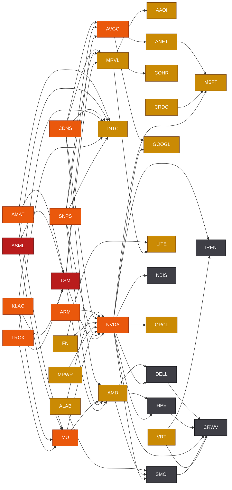

# AI Supply Chain — sand to tokens

How the portfolio's names stack up along the AI-compute chain, and where the real
bottlenecks sit. A "chokepoint" is a layer where few suppliers gate everyone
downstream — that's where pricing power and single-points-of-failure live. Ratings
are each stock note's `### Only They Do` → `**Chokepoint:**` line; update them
there and reflect changes here.

## The chain (upstream → downstream)
**Design enablement (gates everything below):** EDA software [[SNPS]] · [[CDNS]] and CPU IP
[[ARM]] — required to design and verify any chip *before* it is fabbed; see [[EDA & chip IP]].

1. **Raw inputs & materials** — [[Rare-earth magnets|rare-earth magnets]] [[MP]]; optical substrates
   (InP/SiC) made in-house by [[COHR]]. Silicon wafers, gases: not held.
2. **[[Wafer-fab equipment|Fab equipment (WFE)]]** — [[AMAT]] (deposition/epi/implant),
   [[ASML]] (sole EUV — Extreme), [[LRCX]] (etch/deposition), [[KLAC]] (process control).
   External: Tokyo Electron. *Five vendors gate every fab.*
3. **Foundry / manufacturing** — [[TSM]] (leading-edge [[Foundry process nodes|nodes]] + [[CoWoS]] packaging);
   [[INTC]] (aspiring second source). External: Samsung. **The narrowest point.**
4. **Memory (HBM)** — [[MU]], one of only three [[HBM]] makers and the only US-based
   one. External: SK Hynix (leader), Samsung. HBM stacks co-package onto the GPU
   die — **a second hard bottleneck alongside foundry**, sold out through 2026.
5. **Chip design** — GPUs [[NVDA]] ([[CUDA]] moat) + [[AMD]]; [[Custom AI silicon|custom ASICs]] [[AVGO]], [[MRVL]]; [[INTC]].
   All fabbed upstream at [[TSM]].
6. **[[Optical interconnect]] & [[AI cluster networking|fabric]]** — transceivers [[AAOI]], [[COHR]], [[LITE]];
   integration [[POET]]; DSP [[MRVL]]; systems [[NOK]], [[CIEN]]; contract mfg [[FN]]; merchant
   Ethernet switching [[ANET]] (on [[AVGO]] silicon); connectivity silicon — retimers/AECs —
   [[ALAB]] · [[CRDO]]. Wires GPUs into clusters (scale-out; see [[GPU interconnect]]).
7. **Servers & systems** — [[SMCI]], [[HPE]], [[DELL]]. Assembly layer; abundant — [[Liquid cooling|liquid-cooled]] at GB200 densities.
8. **[[Datacenter power|Power]], grid & buildout** — generation + grid equipment [[GEV]]
   (transformers, switchgear, gas/nuclear turbines — multi-year lead times); datacenter
   power & cooling equipment [[VRT]] · [[ETN]] (UPS, switchgear, liquid-cooling CDUs);
   board-level power silicon [[MPWR]] (GPU VRMs); developers [[APLD]] (hyperscaler-leased
   "AI factories"), [[IREN]] (owns renewable-powered sites); advanced nuclear [[OKLO]]
   (pre-operational); electrical construction [[DY]]. Increasingly the *real* constraint
   on new datacenters.
9. **[[Neocloud economics|Neocloud]] capacity** — [[NBIS]], [[CRWV]], [[IREN]]. Rent GPUs at scale; the
   scarcity is upstream of them, not in them.
10. **Hyperscalers, models & apps** — [[MSFT]] (Azure + OpenAI); workflow/software
   [[NOW]], [[IBM]]. Where tokens get sold.

## Chokepoints, ranked
| Rating | Name | Why it gates the chain |
| --- | --- | --- |
| **Extreme** | [[TSM]] | Only volume source of leading-edge logic + CoWoS; nearly every AI chip here is made here. Taiwan concentration risk. |
| **Extreme** | [[ASML]] | Sole maker of EUV lithography — no leading-edge chip can be printed without it. The deepest single-vendor monopoly in the chain. |
| **High** | [[AMAT]] | One of five WFE vendors; fabs can't ramp next-gen nodes without its epi/implant/deposition tools. |
| **High** | [[LRCX]] · [[KLAC]] | The rest of the WFE oligopoly — etch/deposition (Lam) and process control (~52%, KLA); fabs can't ramp without them. |
| **High** | [[AVGO]] | ~70% of custom-AI-ASIC co-design (Google/Meta/OpenAI) + AI Ethernet silicon; the main route around NVIDIA. |
| **High** | [[NVDA]] | CUDA lock-in + supply allocation; escape routes (AMD ROCm, custom ASIC) exist but are immature. |
| **High** | [[MU]] | One of only three HBM makers (with SK Hynix, Samsung); HBM is mandatory on every AI GPU and sold out through 2026. #3 by share but the only US-based source. |
| **High** | [[SNPS]] · [[CDNS]] | The EDA software duopoly — essentially no advanced chip is designed or verified without their tools. Not Extreme (two viable vendors + Siemens EDA). |
| **Medium–High** | [[ARM]] | Near-ubiquitous CPU IP (Grace, hyperscaler CPUs, mobile); deep ecosystem lock-in, but licensable and RISC-V is a growing royalty-free escape. |
| **High (Western) / Low (global)** | [[MP]] | Sole scaled US rare-earth + magnet source; strategic for de-risking from China, but China sets global price. |
| **Medium** | [[MRVL]] | Custom-ASIC + interconnect IP duopoly (with Broadcom). |
| **Medium** | [[COHR]] · [[LITE]] · [[AAOI]] | Optical-interconnect capacity; vertically integrated/non-China supply is scarce but multi-sourced. |
| **Medium** | [[ANET]] · [[ALAB]] · [[CRDO]] | AI cluster networking — merchant Ethernet switching (Arista) + connectivity silicon/retimers/AECs; strong and fast-growing, but multi-sourced and competing with NVIDIA/Broadcom. |
| **Medium** | [[GEV]] | Large grid transformers/switchgear + gas/nuclear turbines; multi-year lead times gate datacenter energization. One of several global makers (Siemens Energy, Hitachi Energy, ABB). |
| **Medium** | [[VRT]] · [[MPWR]] | Integrated datacenter power+thermal (Vertiv UPS/switchgear/CDUs) and GPU board-power silicon (Monolithic VRMs) — real AI-rack deployment constraints, but multi-sourced. |
| **Medium** | [[IBM]] | Mainframe sole-supply — real, but a shrinking niche, off the AI critical path. |
| **Low–Medium** | [[INTC]] · [[AMD]] · [[MSFT]] · [[OKLO]] · [[PRQR]] · [[CIEN]] · [[FN]] · [[ETN]] | Strategic/commercial moats or differentiated-but-substitutable positions, not physical gates. |
| **Low / None** | [[SMCI]] [[HPE]] [[DELL]] [[APLD]] [[DY]] [[NBIS]] [[CRWV]] [[IREN]] [[POET]] [[NOK]] [[NOW]] [[RGTI]] [[ASTS]] [[HOOD]] [[BYND]] [[TLRY]] [[CGC]] [[ARTV]] [[IKT]] [[TTWO]] | Competitive or capacity layers; no supplier here gates the build-out. |

## Reading the map
- **The chain narrows hardest in the middle — equipment, foundry, memory, chip
  design.** Raw capacity (servers, neoclouds) is abundant; the gates are *making
  the chips* — equipment ([[AMAT]]), the foundry ([[TSM]]), and HBM memory
  ([[MU]]). HBM is the quietest of the three: only three suppliers, sold out
  through 2026, and a GPU can't hit full speed without it.
- **Watchlist leads from the gaps:** the equipment/design/optics names that were
  the biggest gaps are now tracked ([[ASML]], [[LRCX]], [[KLAC]], [[AVGO]], [[AMD]],
  [[DELL]], [[CIEN]], [[FN]]). Remaining external gaps: SK Hynix & Samsung (HBM),
  Tokyo Electron (equipment), Innolight (optics).
- **Power is the rising chokepoint:** if compute supply catches up, energy and
  grid-connected land ([[IREN]], [[OKLO]]) become the binding constraint — now joined
  by the gear and labor that energize sites: grid equipment [[GEV]] (multi-year
  transformer lead times), developers [[APLD]], and electrical construction [[DY]].

## Dependency graph
<!-- graph:start -->

_Nodes colored by chokepoint severity (Extreme/High = red/orange, Medium = amber, Low = grey). 32 nodes, 58 edges. Auto-generated 2026-06-23 from each note's Supply Chain section._
<!-- graph:end -->

## Key dependencies
Supplier→customer edges, aggregated from each note's Supply Chain section.
- **Fan-in = systemic bottleneck** (many funnel through one supplier):
  - [[AMAT]], [[ASML]], [[LRCX]], [[KLAC]] → every fab: [[TSM]], [[INTC]], [[MU]] ([[ASML]] EUV is sole-source)
  - [[TSM]] → [[NVDA]], [[MRVL]], [[AVGO]], [[AMD]] (+ Apple) — fab + CoWoS
  - [[MU]] + SK Hynix/Samsung → [[NVDA]] — HBM
  - [[NVDA]] → the whole downstream: hyperscalers ([[MSFT]] + Google/Meta/Amazon),
    neoclouds [[CRWV]]/[[NBIS]]/[[IREN]], builders [[SMCI]]/[[HPE]]/[[DELL]]
- **Fan-out = company-specific risk** (leans on a few suppliers/customers):
  - Optics ([[AAOI]], [[COHR]], [[LITE]]) → hyperscaler customer concentration (external)
  - Neoclouds ([[CRWV]], [[NBIS]], [[IREN]]) → single-supplier dependence on [[NVDA]]
    (plus CRWV's GPU-collateralized debt — see [[Neocloud economics]])
  - [[SMCI]], [[HPE]] → [[NVDA]] GPU allocation gates their AI-server revenue

## Related
- Sectors: [[Semiconductors]] · [[Networking & Optical]] · [[AI Infrastructure]] · [[Power & Infrastructure]] · [[Materials]]
